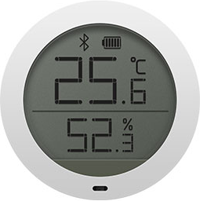

# homebridge-hygrothermograph-cgdk2
This is a modified fork of [homebridge-mi-hygrothermograph](https://github.com/hannseman/homebridge-mi-hygrothermograph) for the Qingping Temp & RH Lite (CGDK2) temperature sensor.
<!-- [](https://github.com/homebridge/homebridge/wiki/Verified-Plugins)
[](https://www.npmjs.com/package/homebridge-mi-hygrothermograph) [](https://www.npmjs.com/package/homebridge-mi-hygrothermograph) [](https://travis-ci.com/hannseman/homebridge-mi-hygrothermograph) [](https://coveralls.io/github/hannseman/homebridge-mi-hygrothermograph?branch=master) -->

[Homebridge](https://github.com/nfarina/homebridge) plugin for exposing measured temperature and humidity as [HomeKit](https://www.apple.com/ios/home/) accessories.

Supported sensors:

* [Qingping Temp & RH Lite (CGDK2)](https://www.aliexpress.com/item/1005002175838299.html)



## Installation
Make sure your system matches the prerequisites. You need to have a C compiler and [Node.js](https://nodejs.org/) newer or equal to version 10.0.0 installed.

[Noble](https://github.com/noble/noble) is BLE central module library for [Node.js](https://nodejs.org/) used to discover and read values from the sensor.

 These libraries and their dependencies are required by the [Noble](https://www.npmjs.com/package/noble) library and provide access to the kernel Bluetooth subsystem:

```sh
sudo apt-get install bluetooth bluez libbluetooth-dev libudev-dev
```

For more detailed information and descriptions for other platforms please see the [Noble documentation](https://github.com/noble/noble#readme).

### Install homebridge and this plugin
```
[sudo] npm install -g --unsafe-perm homebridge
[sudo] npm install -g --unsafe-perm homebridge-hygrothermograph-cgdk2
```

**Note:** depending on your platform you might need to run `npm install -g`  with root privileges.

See the [Homebridge documentation](https://github.com/nfarina/homebridge#readme) for more information.

If you are running Homebridge as another user than `root`  (you should) then some additional configuration needs to be made to allow [Node.js](https://nodejs.org/) access to the kernel Bluetooth subsystem without root privileges.

You'll need to grant the node binary cap_net_raw privileges:

```
sudo setcap cap_net_raw+eip $(eval readlink -f `which node`)
```

Please see the [Noble documentation](https://github.com/noble/noble#running-without-rootsudo) for more details.


## Homebridge configuration
Update your Homebridge `config.json` file. See [config-sample.json](config-sample.json) for a complete example.

```json
"accessories": [
    {
      "accessory": "HygrothermographCgdk2",
      "name": "Temperature & Humidity"
    }
]
```

| Key                     | Default         | Description                                                                                                                                                                                                 |
|-------------------------|-----------------|-------------------------------------------------------------------------------------------------------------------------------------------------------------------------------------------------------------|
| `accessory`             |                 | Mandatory. The name provided to Homebridge. Must be "HygrothermographCgdk2".                                                                                                                                      |
| `name`                  |                 | Mandatory. The name of this accessory. This will appear in your Home-app.                                                                                                                                   |
| `address`               |                 | Optional. The address of the device. Used when running multiple devices.                                                                                                                                    |
| `timeout`               | `15`            | Time in minutes after last contact when the accessory should be regarded as unreachable. If set to `0`, timeout will be disabled.                                                                           |
| `humidityName`          | `"Humidity"`    | Name of the humidity sensor as it will appear in your Home-app.                                                                                                                                             |
| `temperatureName`       | `"Temperature"` | Name of the temperature sensor as it will appear in your Home-app.                                                                                                                                          |
| `fakeGatoEnabled`       | `false`         | If historical data should be reported to the Elgato Eve App.                                                                                                                                                |
| `fakeGatoStoragePath`   |                 | Optional. Custom path where to save fakegato history.                                                                                                                                                       |
| `mqtt`                  |                 | Optional. Configuration for publishing values to an MQTT-broker. See the [MQTT](#mqtt) section for details.                                                                                                 |
| `forceDiscovering`      | `true`          | Retry start scanning for devices when stopped. For some users scanning will be stopped when connecting to other BLE devices. Setting `forceDiscovering` to `true` will start scanning again in these cases. |
| `forceDiscoveringDelay` | `2500`          | The delay for when to start scanning again when stopped. Only applicable if `forceDiscovering` is `true`.                                                                                                   |
| `updateInterval`        |                 | By default values will be updated as they come in. Often this is once per second, if this is not desired `updateInterval` can be set to how often updates should be made. Accepts values in seconds.        |
| `lowBattery`            | `10`            | At what battery percentage Homekit should start warning about low battery.                                                                                                                                  |
| `disableBatteryLevel`   | `false`         | If battery level should not be exposed to Homekit. New E-Ink sensors do currently not support sending battery levels and setting this to `true` will make Elgato Eve not warn about it.                     |
| `temperatureOffset`     | `0`             | An offset to apply to temperature values for calibration if measured values are incorrect.                                                                                                                  |
| `humidityOffset`        | `0`             | An offset to apply to humidity values for calibration if measured values are incorrect.                                                                                                                     |


### Multiple sensors
When running just one HygrothermographCgdk2 accessory there is no need to specify the address of the BLE device.
But if you want to run multiple HygrothermographCgdk2 accessories you need to specify the BLE address for each of them.
If the address is not specified they will interfere with each other.

The easiest way to find the address of the device is to use `[sudo] hcitool lescan`.
It will start a scan for all advertising BLE peripherals within range. Look for `MJ_HT_V1` and copy the address.
The address is in the format of `4c:64:a8:d0:ae:65`.

Update your Homebridge `config.json` and specify the `address` key:

```json
"accessories": [
    {
      "accessory": "HygrothermographCgdk2",
      "name": "Room 1",
      "address": "4c:64:a8:d0:ae:65"
    },
    {
      "accessory": "HygrothermographCgdk2",
      "name": "Room 2",
      "address": "2c:34:b3:d4:a1:61"
    }
]
```

Note that this step is also required when running [Mi Flora](https://xiaomi-mi.com/sockets-and-sensors/xiaomi-huahuacaocao-flower-care-smart-monitor/) devices in the same location as they use the same protocol and their data will be intercepted by this plugin.

#### MacOS

On MacOS `hcitool` can't be used since MacOS does not provide a way to read the MAC-address of a BLE device.
Instead MacOS assigns a device unique identifier for each BLE device in the format of `5C61F8CE-9F0B-4371-B996-5C9AE0E0D14B`.
This identifier can be found using MacOS tools like [Bluetooth Explorer](https://developer.apple.com/bluetooth/).
One can also run Homebridge with debug-mode enabled by using `homebridge -D` and then watch the logs for the string "Discovered peripheral" and fetch the value under `Id`. Use this identifier as `address` in the configuration file.


### Timeout
If the accessory has not received an updated value from the sensor within the specified timeout it will inform Homekit
that the accessory is not responsive by returning an error until it receives an updated value.

The default timeout is 15 minutes but can be changed by specifying the number of minutes under the `timeout` parameter in `config.json`:

```json
"accessories": [
    {
      "accessory": "HygrothermographCgdk2",
      "name": "Temperature & Humidity",
      "timeout": 30
    }
]
```

If the `timeout` parameter is set to `0` timeouts are disabled and and devices will not be reported as unresponsive to Homekit.

### Naming
By default the Humidity and Temperature accessories visible in the Home-app will have the names "Humidity" and "Temperature". They can be changed in the Home-app if wanted.

It is also possible to set custom initial values by specifying the `humidityName` and `temperatureName` parameters in `config.json`:

```json
{
  "humidityName": "Luftfuktighet",
  "temperatureName": "Temperatur"
}
```

### Elgato Eve

This plugin has support for adding historical data to the [Elgato Eve App](https://itunes.apple.com/us/app/elgato-eve/id917695792) by using the excellent module [fakegato-history](https://github.com/simont77/fakegato-history).

When using this feature it's required to specify the address of the device as described in [Multiple sensors](#multiple-sensors).
This is required because [fakegato-history](https://github.com/simont77/fakegato-history) requires a unique serial number for each device.

When restarting Homebridge the Eve app will show the Accessories as having 0% battery until the sensor actually reports its battery status. This can sometimes take a couple of minutes. Just be patient and the actual battery status will show up.

The E-Ink sensors do not report the current battery level. This will cause Elgato Eve to incorrectly warn about low battery. Set `disableBatteryLevel` to `true` to disable these warnings.

To enable the Elgato Eve feature set `fakeGatoEnabled` to `true` in `config.json`

```json
{
  "fakeGatoEnabled": true
}
```

[fakegato-history](https://github.com/simont77/fakegato-history) caches historical values into a json-file.
Usually located in `/var/lib/homebridge` or `~/.homebridge`. To customise this one can set `fakeGatoStoragePath` to the desired path:

```json
{
  "fakeGatoStoragePath": "/tmp/"
}
```

### MQTT

The plugin can be configured to publish temperature/humidity/battery values to an MQTT-broker.

Basic configuration:

```json
{
  "mqtt": {
    "url": "mqtt://test.mosquitto.org",
    "temperatureTopic": "sensors/temperature",
    "humidityTopic": "sensors/humidity",
    "batteryTopic": "sensors/battery"
  }
}
```

If one is interested in only publishing a specific value just skip configuring the topics wished to ignore:

```json
{
  "mqtt": {
    "url": "mqtt://test.mosquitto.org",
    "temperatureTopic": "sensors/temperature"
  }
}
```

To enable authentication specify the `username` and `password` parameters:

```json
{
  "mqtt": {
    "url": "mqtt://test.mosquitto.org",
    "username": "admin",
    "password": "hunter2",
    "temperatureTopic": "sensors/temperature"
  }
}
```

For more options see the [MQTT.js documentation](https://github.com/mqttjs/MQTT.js/blob/master/README.md#client).
Everything set in `mqtt` will be passed to the `options` argument on `Client`.
The `Client#publish` options `qos` and `retain` can also be configured the same way.


## Technical details
The plugin scans for [Bluetooth Low Energy](https://en.wikipedia.org/wiki/Bluetooth_Low_Energy) peripherals and check the broadcast advertisement packets.
By only reading the advertisement packet there is no need to establish a connection to the peripheral.
Inside each packet discovered we look for Service Data with a UUID of `0xfe95`. If found we start trying to parse the actual Service Data to find the temperature and humidity.

`50:20:aa:01:be:64:ae:d0:a8:65:4c:0d:10:04:cc:00:8a:01` represents the following:

| byte  | function      | type      |
|:-----:|---------------|-----------|
| 1-2   | Frame control | bit field |
| 3-4   | ID            | uint16LE  |
| 5     | Index         | uint8LE   |
| 6-11  | MAC-address   | string    |
| 12-13 | Type of data  | uint16LE  |
| 14    | Length        | uint8LE   |
| 15-16 | Temperature   | int16LE   |
| 17-18 | Humidity      | uint16LE  |

Bytes 1-14 have the same function for all 4 variations but the following bytes contain different sensor data.

## Automation (iOS 13+)
There is a new very handy automation option in iOS 13 allowing us to convert home automation rule to "Advanced shortcut".

Using that you can make rules like "If temperature drops below 21C and someone is at home and it is not during night then turn on heater". Unfortunately you can't normally bind this rule to any timer trigger. However you can use other homebridge plugin which fakes sensor events e.g. every 5 seconds and you can bind that rule to it! Check https://github.com/nitaybz/homebridge-delay-switch

## Known problems
Some hardware combinations are problematic and may cause weird troubles like sensor timeout after some time etc.
* Asus BT-400 bluetooth dongle (at least in combination with older RPi 2B)
* Raspbian Stretch is known to get recurring timeouts with certain RPi-models. Upgrade to Buster or newer and if not possible one can mitigate this by triggering a `hcitool lescan`. Automate this by adding the following to your crontab file: `0 * * * * sudo timeout -s INT 1s hcitool lescan`.

## Legal

*Qingping* is a registered trademarks of Qingping Technology (Beijing) Co., Ltd.

This project is in no way affiliated with, authorized, maintained, sponsored or endorsed by *Qingping* or any of its affiliates or subsidiaries.
